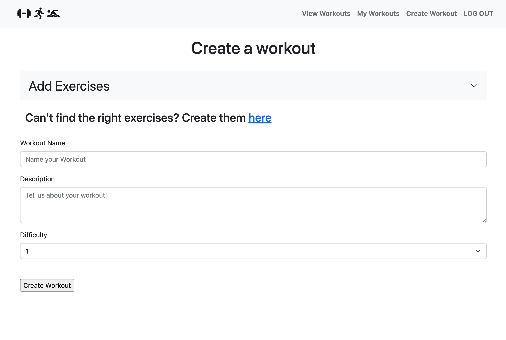

# Workout App: Project 2

An app for creating and finding workouts

I find that sometimes just deciding what to do at the gym is the hardest part of working out. So I made an ap where people can create workouts and save them for future reference. Users can then view other user's workouts and save them for their own use. 

## Screenshots

landing page

User's page

Create workout

View workout

## Technologies Used: 
* EJS
* CSS
* Javascript
* MongoDB
* Express

## Getting Started: 
#### Visit the app here: 
#### Project planning trello: https://trello.com/b/19kain49/project-2

## Icebox (future improvements)
* Add the ability to sort lists (date created, difficulty, etc.)
* Add depth to workouts and exercises (equipment, time, muscle groups, etc.)
